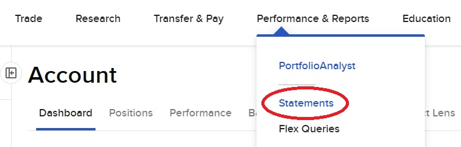
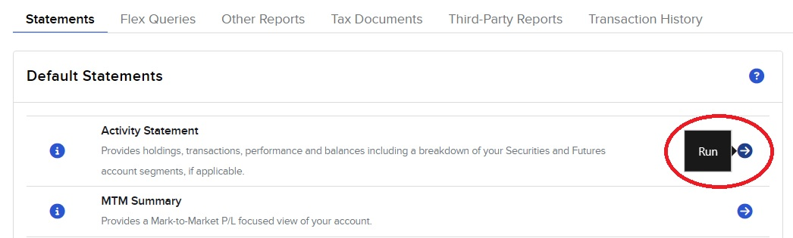
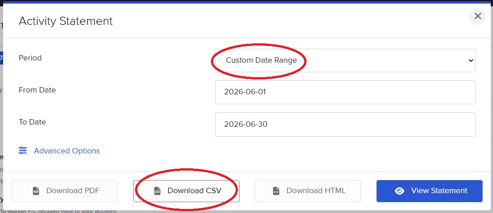

# IBKR-to-Xero

Convert an Interactive Brokers **Activity Statement** into per-currency CSV files ready for
import into [Xero](https://www.xero.com/) (or any tool that accepts Xero's bank-statement
CSV format) — with **strict cash reconciliation** built in.

```
*Date,*Amount,Payee,Description,Reference,Cheque Number
2026-06-12,21749.53,Interactive Brokers,-100 ABCD price: 217.5 comm: -0.47,,
2026-06-19,0,Interactive Brokers,1xWXYZ 18JUN26 95 C,,
2026-06-15,-60000,Interactive Brokers,Disbursement,,
2026-06-03,-1108.33,Interactive Brokers,AUD Debit Interest for May-2026,,
```

## Why

Feeding brokerage activity into accounting software by hand is tedious and error-prone.
The IB Activity Statement contains everything needed, but as a single multi-section CSV
mixing many currencies with base-currency summaries. IBKR-to-Xero extracts the actual cash
movements per currency and — crucially — **proves that they add up before writing anything**:

> For every currency: `Starting Cash + Σ(transactions) = Ending Cash`
> (as reported by the statement's own Cash Report section).

If anything doesn't reconcile — an unexplained cash component, an unsupported trade type,
a residual beyond rounding tolerance — the input is **rejected with a detailed report and
no output is written**. Wrong output is worse than no output.

## What it handles

| Statement section | Becomes |
|---|---|
| Trades — Stocks, Bonds | `{qty} {symbol} price: {price} comm: {commission}` |
| Trades — Equity and Index Options | `{qty}x{contract}` (premiums, assignments, expiries) |
| Trades — Forex | a transfer: one leg in each currency's file, tagged `FX`; USD commission row tagged `FX-FEE` |
| Trades — Futures | per-trade commission rows only (notional never touches cash); P/L via the `MTM` line |
| Corporate Actions | share movements and residual cash payments, tagged `CORP` |
| Deposits & Withdrawals | description passed through |
| Fees | description passed through |
| Dividends (incl. payments in lieu) | description passed through |
| Withholding Tax | description passed through |
| Interest (incl. bond coupons and accrued interest) | description passed through |

Per-trade transaction fees (e.g. HK stamp duty) are already embedded in each trade's
commission; the tool cross-checks the section against the Cash Report instead of
double-counting it.

Synthetic lines may be appended, clearly tagged in the `Reference` column so they can be
reviewed:

- **`MTM`** — `Cash Settling MTM` (futures cash mark-to-market): the statement reports it
  as a period total with no per-transaction rows, so it is emitted as one line dated at the
  period end.
- **`GST`** — GST charged on account fees is reported only as a period total (never as
  dated rows); the unattributed part is emitted as one line, guarded by a strict envelope
  check against the Cash Report's GST component.
- **`ROUNDING`** — the residual from rounding full-precision IB amounts to 2 decimal
  places, only when nonzero and within a strict tolerance (½ cent per line). Anything
  larger is treated as an error and rejects the input.

Currencies with no cash activity produce no file. Base-currency summaries and FX
translation adjustments are intentionally ignored — every output file is purely in its own
currency.

## Install

Requires Python 3.11+. No runtime dependencies (standard library only).

```sh
git clone https://github.com/skoulik/IBKR-to-Xero.git
cd IBKR-to-Xero
pip install -e .
```

## Getting the statement

In the IB Client Portal, download an Activity Statement in **CSV** format:

1. Open **Performance & Reports → Statements**:

   

2. Under **Default Statements**, run the **Activity Statement**:

   

3. Pick the period (e.g. a custom date range) and click **Download CSV**:

   

## Usage

Once you have the statement CSV:

```sh
ibkr2xero statement.csv           # writes into statement/ next to the file
ibkr2xero statement.csv -o out/   # or into a chosen directory
```

Existing output files are never overwritten: the run aborts without writing anything
unless `--force-overwrite` is given.

Zero-amount transactions (e.g. option expiries) are included by default so the output
mirrors the statement; pass `-s`/`--skip-zero-transactions` to omit them (they carry no
cash and Xero discards them on import anyway).

```
account U1234567, period 2026-06-01 to 2026-06-30
  out\AUD.csv: 5 transactions, cash -12345.67 -> -23456.78
  out\USD.csv: 157 transactions, cash -5432.10 -> 8765.43
    note: synthetic MTM row for Cash Settling MTM: 2575
    note: synthetic ROUNDING row: -0.07
```

On reconciliation failure nothing is written and the exit code is 2:

```
error: input rejected: cash does not reconcile (1 problem(s)):
  - AUD: section 'Interest' transactions sum to -1108.34 but Cash Report says -1108.33 (off by -0.01)
no output files were written.
```

## How reconciliation works

1. **Cash Report internal consistency** — per currency, starting cash plus all reported
   cash-flow components must equal ending cash.
2. **Component cross-checks** — every Cash Report component is matched against the sum of
   the transactions extracted from its section (e.g. *Trades (Sales) + Trades (Purchase) +
   Commissions + GST* must equal the net cash of all trade rows).
3. **Unknown components** — any Cash Report component the tool doesn't recognise, with a
   nonzero amount, rejects the input.
4. **Rounding control** — after rounding to 2 dp, the residual against
   `round(ending) − round(starting)` must stay within tolerance.

All money arithmetic uses `decimal.Decimal` end to end; floats never touch amounts.
All failures across all currencies are gathered into a single report.

## Development

```sh
pip install -e .[dev]
pytest
```

The test suite includes end-to-end tests that run against a real (private) statement in
`examples/`; that folder is gitignored, and those tests skip automatically when it is
absent.

## Roadmap

- More trade asset categories (warrants, structured products) as examples appear
- Web / Telegram bot front-end over the same library core
- Direct Xero API integration (skip the CSV import step)

See [TODO.md](TODO.md) for details.

## License

[MIT](LICENSE)
